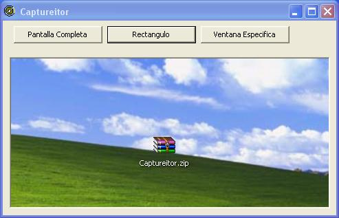



## Captureitor \- \(Screen capture\)

### Description

Just a simple and good screen capture, captures "complete screen", a "rectangle area" or a "specified window".
 
### More Info
 

             |
---                |---
**Submitted On**   |2006-05-07 03:29:30
**By**             |[\\\_Alex\_/](https://github.com/Planet-Source-Code/PSCIndex/blob/master/ByAuthor/alex.md)
**Level**          |Beginner
**User Rating**    |4.5 (18 globes from 4 users)
**Compatibility**  |VB 6\.0
**Category**       |[Complete Applications](https://github.com/Planet-Source-Code/PSCIndex/blob/master/ByCategory/complete-applications__1-27.md)
**World**          |[Visual Basic](https://github.com/Planet-Source-Code/PSCIndex/blob/master/ByWorld/visual-basic.md)
**Archive File**   |[Captureito2055313222007\.zip](https://github.com/Planet-Source-Code/alex-captureitor-screen-capture__1-68186/archive/master.zip)

